# 🏗️ NexusCommerce Terraform Infrastructure

<div align="center">


**Infrastructure as Code for Cloud-Native E-Commerce Microservices Platform**

[🚀 Quick Start](#-quick-start) • [🏗️ Architecture](#️-architecture) • [📖 Modules](#-modules) • [🌍 Environments](#-environments)

[](https://terraform.io)
[](https://registry.terraform.io/providers/hashicorp/aws)
[](LICENSE)

</div>

---

## 📋 Table of Contents

- [Overview](#-overview)
- [Architecture](#️-architecture)
- [Prerequisites](#-prerequisites)
- [Quick Start](#-quick-start)
- [Modules](#-modules)
- [Environments](#-environments)
- [Deployment Workflow](#-deployment-workflow)
- [Service Mesh Observability](#-service-mesh-observability)
- [Monitoring](#-monitoring)
- [Contributing](#-contributing)

---

## 🌟 Overview

This repository contains Terraform Infrastructure as Code (IaC) for provisioning and managing the complete cloud infrastructure required to run the **NexusCommerce** microservices platform. It follows best practices for multi-environment deployments and cost optimization with comprehensive service mesh observability.

### 🎯 Key Features

- **🏗️ Modular Architecture**: Reusable, composable Terraform modules
- **🌍 Multi-Environment**: Separate configurations for dev, staging, and production
- **📊 Service Mesh Observability**: Complete Istio + Kiali monitoring
- **🔍 Advanced Monitoring**: Prometheus, Grafana, and ELK stack integration
- **🔄 GitOps Integration**: Seamlessly integrates with ArgoCD workflows
- **🐳 Container Registry**: Docker Hub integration for image management

---

## 🏗️ Architecture

### Infrastructure Overview


### Service Mesh Architecture with Kiali


### Terraform Module Dependencies


### Multi-Environment Strategy


### Resource Sizing by Environment

```mermaid
graph TB
    subgraph "Development Environment"
        DEV_SPECS["
        💻 EKS: 3 nodes (t3.medium)
        🗄️ RDS: db.t3.micro
        🔄 Redis: cache.t3.micro
        📊 Kafka: kafka.t3.small
        🕸️ Istio + Kiali: Basic setup
        "]
    end
    
    subgraph "Staging Environment"
        STAGE_SPECS["
        🖥️ EKS: 5 nodes (t3.large)
        🗄️ RDS: db.t3.small
        🔄 Redis: cache.t3.small
        📊 Kafka: kafka.m5.large
        🕸️ Istio + Kiali: Full observability
        "]
    end
    
    subgraph "Production Environment"
        PROD_SPECS["
        🏭 EKS: 10+ nodes (r5.xlarge)
        🗄️ RDS: db.r5.xlarge (Multi-AZ)
        🔄 Redis: cache.r5.large (Cluster)
        📊 Kafka: kafka.m5.xlarge (HA)
        🕸️ Istio + Kiali: HA + Performance
        "]
    end
    
    DEV_SPECS --> STAGE_SPECS
    STAGE_SPECS --> PROD_SPECS
    
    style DEV_SPECS fill:#87CEEB,stroke:#333,stroke-width:2px,color:#000
    style STAGE_SPECS fill:#FFB347,stroke:#333,stroke-width:2px,color:#000
    style PROD_SPECS fill:#FF6B6B,stroke:#333,stroke-width:2px,color:#fff
```



---

## 📋 Prerequisites

### Required Tools

```bash
# Core Tools
terraform >= 1.5.0
aws-cli >= 2.0
kubectl >= 1.24

# Optional Tools
helm >= 3.8         # For Kubernetes package management
k9s                 # Kubernetes CLI tool
terragrunt          # Terraform wrapper (optional)
```

### AWS Requirements

| Resource | Requirement |
|----------|-------------|
| **AWS Account** | Admin access or sufficient IAM permissions |
| **VPC Limits** | Default VPC limits sufficient |
| **EC2 Limits** | Sufficient for chosen instance types |
| **Route53** | For DNS management |
| **Docker Hub** | For container image registry |

## 🚀 Quick Start

### 1. Clone and Setup

```bash
# Clone the repository
git clone https://github.com/your-org/nexus-commerce-terraform.git
cd nexus-commerce-terraform

# Configure AWS credentials
aws configure

# Set up environment variables
export AWS_REGION=us-west-2
export TF_VAR_environment=dev
export DOCKER_HUB_USERNAME=your-username
```

### 2. Deploy Development Environment

```bash
# Navigate to dev environment
cd environments/dev

# Initialize Terraform
terraform init

# Review the plan
terraform plan -var-file="terraform.tfvars"

# Apply the infrastructure
terraform apply -var-file="terraform.tfvars"
```

### 3. Configure kubectl and Service Mesh

```bash
# Update kubeconfig
aws eks update-kubeconfig \
    --region us-west-2 \
    --name dev-nexus-commerce

# Verify cluster access
kubectl get nodes
kubectl get namespaces

# Access Kiali dashboard
kubectl port-forward -n istio-system svc/kiali 20001:20001
```

### 4. Verify Deployment

```bash
# Check all resources
terraform output

# Test connectivity
kubectl get pods -A
kubectl get svc -A

# Verify Istio and Kiali
kubectl get pods -n istio-system
```

---

## 🧩 Modules

### Core Infrastructure Modules

| Module | Purpose | Dependencies | Outputs |
|--------|---------|--------------|---------|
| **🌐 networking** | VPC, subnets, security groups | None | vpc_id, subnet_ids, security_groups |
| **☸️ kubernetes** | EKS cluster and node groups | networking | cluster_endpoint, node_groups |
| **⚖️ load-balancer** | ALB, target groups, listeners | networking | alb_arn, target_groups |

### Data Layer Modules

| Module | Purpose | Technology | Configuration |
|--------|---------|------------|---------------|
| **🐘 postgresql** | Relational databases | Amazon RDS | Multi-AZ, automated backups |
| **🍃 mongodb** | Document databases | MongoDB Atlas | Replica sets, sharding |
| **🔴 redis** | Caching layer | ElastiCache | Clustering, failover |
| **📊 kafka** | Message streaming | Amazon MSK | Multi-broker, encryption |

### Service Mesh & Observability Modules

| Module | Purpose | Technology | Features |
|--------|---------|------------|----------|
| **🕸️ istio** | Service mesh | Istio | mTLS, traffic management |
| **🔍 kiali** | Service mesh observability | Kiali | Service graph, traffic analysis |
| **📈 prometheus** | Metrics collection | Prometheus | Time-series metrics |
| **📊 grafana** | Monitoring dashboards | Grafana | Custom dashboards, alerting |
| **🔍 zipkin** | Distributed tracing | Zipkin | Request tracing |

### Platform Modules

| Module | Purpose | Technology | Features |
|--------|---------|------------|----------|
| **🔄 argocd** | GitOps deployment | ArgoCD | App of apps, RBAC |
| **📈 observability** | Monitoring stack | ELK, Prometheus, Grafana | Dashboards, alerting |

---

## 🌍 Environments

### Deployment Flow


### Environment Configurations

#### Development
```hcl
# Optimized for development and testing
node_groups = {
  general = {
    instance_types = ["t3.medium"]
    min_size      = 2
    max_size      = 10
    desired_size  = 3
  }
}

postgresql_config = {
  instance_class    = "db.t3.micro"
  allocated_storage = 20
  backup_retention_period = 7
}

istio_config = {
  enable_kiali = true
  kiali_config = {
    auth_strategy = "anonymous"
  }
}
```

#### Staging
```hcl
# Production-like environment for testing
node_groups = {
  general = {
    instance_types = ["t3.large"]
    min_size      = 3
    max_size      = 15
    desired_size  = 5
  }
}

postgresql_config = {
  instance_class    = "db.t3.small"
  allocated_storage = 100
  multi_az         = true
  backup_retention_period = 14
}

istio_config = {
  enable_kiali = true
  kiali_config = {
    auth_strategy = "token"
    external_services = {
      prometheus = true
      grafana = true
      zipkin = true
    }
  }
}
```

#### Production
```hcl
# High availability and performance
node_groups = {
  general = {
    instance_types = ["r5.xlarge"]
    min_size      = 10
    max_size      = 50
    desired_size  = 15
  }
  
  data = {
    instance_types = ["r5.2xlarge"]
    min_size      = 3
    max_size      = 10
    desired_size  = 5
  }
}

postgresql_config = {
  instance_class    = "db.r5.xlarge"
  allocated_storage = 500
  multi_az         = true
  backup_retention_period = 30
  performance_insights_enabled = true
}

istio_config = {
  enable_kiali = true
  kiali_config = {
    auth_strategy = "openid"
    external_services = {
      prometheus = true
      grafana = true
      zipkin = true
    }
    deployment = {
      replicas = 2
      resources = {
        requests = {
          cpu = "100m"
          memory = "128Mi"
        }
        limits = {
          cpu = "1"
          memory = "1Gi"
        }
      }
    }
  }
}
```

---

## 🔄 Deployment Workflow

### CI/CD Pipeline Integration


---

## 🔍 Service Mesh Observability


### Accessing Kiali

```bash
# Port forward to access Kiali dashboard
kubectl port-forward -n istio-system svc/kiali 20001:20001

# Access via browser
open http://localhost:20001

# Or use kubectl proxy
kubectl proxy &
open http://localhost:8001/api/v1/namespaces/istio-system/services/kiali:20001/proxy/
```

### Kiali Configuration Options

```yaml
# kiali-config.yaml
apiVersion: v1
kind: ConfigMap
metadata:
  name: kiali
  namespace: istio-system
data:
  config.yaml: |
    auth:
      strategy: "anonymous"  # For dev, use "token" or "openid" for prod
    deployment:
      image_name: "quay.io/kiali/kiali"
      image_version: "latest"
    external_services:
      prometheus:
        url: "http://prometheus:9090"
      grafana:
        enabled: true
        in_cluster_url: "http://grafana:3000"
      zipkin:
        enabled: true
        in_cluster_url: "http://zipkin:9411"
    server:
      web_root: "/kiali"
```

---

## 📊 Monitoring


### Key Metrics Monitored

| Category | Metrics | Tools |
|----------|---------|--------|
| **Service Mesh** | Request rate, Success rate, Duration, Traffic flow | Kiali + Istio |
| **Infrastructure** | CPU, Memory, Disk, Network | Prometheus + Grafana |
| **Kubernetes** | Pod health, Resource usage | Kubernetes Dashboard |
| **Applications** | Response time, Error rate, Throughput | Custom metrics + Kiali |
| **Databases** | Connections, Query performance | RDS/Atlas monitoring |
| **Service Communication** | mTLS status, Circuit breakers | Kiali + Istio |

### Kiali-Specific Monitoring

```bash
# View service graph
echo "Access Kiali service graph for real-time topology"

# Monitor traffic policies
kubectl get virtualservices -A
kubectl get destinationrules -A

# Check mTLS status
kubectl get peerauthentications -A
kubectl get authorizationpolicies -A

# Validate configuration
kubectl get gateway -A
kubectl get serviceentries -A
```

---

## 🛠️ Advanced Usage

### Custom Module Development

```bash
# Create a new module
mkdir -p modules/my-service
cd modules/my-service

# Standard module structure
touch main.tf variables.tf outputs.tf versions.tf README.md

# Follow module best practices
terraform-docs markdown table --output-file README.md .
```

### Testing Infrastructure

```bash
# Validate Terraform syntax
terraform validate

# Format code
terraform fmt -recursive

# Plan without applying
terraform plan -detailed-exitcode

# Integration tests
go test ./tests/...
```

### Kiali Configuration Testing

```bash
# Test Kiali API
kubectl exec -n istio-system deployment/kiali -- \
    curl -s http://localhost:20001/api/status

# Validate service mesh configuration
kubectl exec -n istio-system deployment/kiali -- \
    curl -s "http://localhost:20001/api/namespaces/default/services"

# Test graph API
kubectl exec -n istio-system deployment/kiali -- \
    curl -s "http://localhost:20001/api/namespaces/graph?namespaces=default"

# Test Zipkin integration
kubectl get pods -n istio-system | grep zipkin
kubectl logs -n istio-system deployment/zipkin
```

---

## 🤝 Contributing

### Development Workflow

1. **Fork & Clone**
   ```bash
   git clone https://github.com/your-username/nexus-commerce-terraform.git
   cd nexus-commerce-terraform
   ```

2. **Create Feature Branch**
   ```bash
   git checkout -b feature/new-module
   ```

3. **Make Changes**
   - Follow Terraform best practices
   - Update documentation
   - Add tests
   - Configure Kiali integration

4. **Test Changes**
   ```bash
   make validate
   make test
   ```

5. **Submit Pull Request**
   - Clear description
   - Reference issues
   - Include test results

### Module Standards

- **📝 Documentation**: Every module must have a README
- **🧪 Testing**: Include unit and integration tests
- **🏷️ Tagging**: Consistent resource tagging
- **🔍 Observability**: Kiali and monitoring integration

---

## 📚 Resources

### Official Documentation
- [Terraform AWS Provider](https://registry.terraform.io/providers/hashicorp/aws/latest/docs)
- [AWS EKS Best Practices](https://aws.github.io/aws-eks-best-practices/)
- [Kubernetes Documentation](https://kubernetes.io/docs/)
- [Istio Documentation](https://istio.io/latest/docs/)
- [Kiali Documentation](https://kiali.io/docs/)

### Service Mesh Resources
- [Istio Best Practices](https://istio.io/latest/docs/ops/best-practices/)
- [Kiali Configuration](https://kiali.io/docs/configuration/)
- [Service Mesh Patterns](https://www.oreilly.com/library/view/service-mesh-patterns/9781492086444/)

### Container Registry
- [Docker Hub Documentation](https://docs.docker.com/docker-hub/)
- [Docker Best Practices](https://docs.docker.com/develop/dev-best-practices/)

---

## 📄 License

This project is licensed under the MIT License - see the [LICENSE](LICENSE) file for details.

---

## 🆘 Support

### Getting Help
- **📖 Documentation**: Check the docs/ directory
- **🐛 Issues**: [GitHub Issues](https://github.com/your-org/nexus-commerce-terraform/issues)
- **💬 Discussions**: [GitHub Discussions](https://github.com/your-org/nexus-commerce-terraform/discussions)

### Contact
- **Email**: devops@nexuscommerce.com
- **Slack**: [#infrastructure](https://nexuscommerce.slack.com/channels/infrastructure)

---

<div align="center">

**⭐ If this helps your infrastructure journey, please give it a star! ⭐**

Made with ❤️ by the NexusCommerce Platform Team


</div>

