# 🏗️ NexusCommerce Terraform Infrastructure

<div align="center">


**Infrastructure as Code for Cloud-Native E-Commerce Microservices Platform**

[🚀 Quick Start](#-quick-start) • [🏗️ Architecture](#️-architecture) • [📖 Modules](#-modules) • [🌍 Environments](#-environments)

[](https://terraform.io)
[](https://registry.terraform.io/providers/hashicorp/aws)
[](LICENSE)
[](https://github.com/aquasecurity/tfsec)

</div>

---

## 📋 Table of Contents

- [Overview](#-overview)
- [Architecture](#️-architecture)
- [Prerequisites](#-prerequisites)
- [Quick Start](#-quick-start)
- [Modules](#-modules)
- [Environments](#-environments)
- [Deployment Workflow](#-deployment-workflow)
- [Security](#-security)
- [Monitoring](#-monitoring)
- [Cost Management](#-cost-management)
- [Contributing](#-contributing)

---

## 🌟 Overview

This repository contains Terraform Infrastructure as Code (IaC) for provisioning and managing the complete cloud infrastructure required to run the **NexusCommerce** microservices platform. It follows best practices for multi-environment deployments, security, and cost optimization.

### 🎯 Key Features

- **🏗️ Modular Architecture**: Reusable, composable Terraform modules
- **🌍 Multi-Environment**: Separate configurations for dev, staging, and production
- **🔒 Security First**: Built-in security controls and compliance
- **📊 Observability Ready**: Complete monitoring and logging infrastructure
- **💰 Cost Optimized**: Right-sized resources with auto-scaling
- **🔄 GitOps Integration**: Seamlessly integrates with ArgoCD workflows

---

## 🏗️ Architecture

### Infrastructure Overview


### Terraform Module Dependencies


### Multi-Environment Strategy


### Resource Sizing by Environment

```mermaid
graph TB
    subgraph "Development Environment"
        DEV_SPECS["
        💻 EKS: 3 nodes (t3.medium)
        🗄️ RDS: db.t3.micro
        🔄 Redis: cache.t3.micro
        📊 Kafka: kafka.t3.small
        💰 Est. Cost: $200-400/month
        "]
    end
    
    subgraph "Staging Environment"
        STAGE_SPECS["
        🖥️ EKS: 5 nodes (t3.large)
        🗄️ RDS: db.t3.small
        🔄 Redis: cache.t3.small
        📊 Kafka: kafka.m5.large
        💰 Est. Cost: $400-800/month
        "]
    end
    
    subgraph "Production Environment"
        PROD_SPECS["
        🏭 EKS: 10+ nodes (r5.xlarge)
        🗄️ RDS: db.r5.xlarge (Multi-AZ)
        🔄 Redis: cache.r5.large (Cluster)
        📊 Kafka: kafka.m5.xlarge (HA)
        💰 Est. Cost: $1000-5000+/month
        "]
    end
    
    DEV_SPECS --> STAGE_SPECS
    STAGE_SPECS --> PROD_SPECS
    
    style DEV_SPECS fill:#87CEEB,stroke:#333,stroke-width:2px,color:#000
    style STAGE_SPECS fill:#FFB347,stroke:#333,stroke-width:2px,color:#000
    style PROD_SPECS fill:#FF6B6B,stroke:#333,stroke-width:2px,color:#fff
```



---

## 📋 Prerequisites

### Required Tools

```bash
# Core Tools
terraform >= 1.5.0
aws-cli >= 2.0
kubectl >= 1.24

# Optional Tools
helm >= 3.8         # For Kubernetes package management
k9s                 # Kubernetes CLI tool
terragrunt          # Terraform wrapper (optional)
tfsec               # Security scanner
checkov             # Policy scanner
```

### AWS Requirements

| Resource | Requirement |
|----------|-------------|
| **AWS Account** | Admin access or sufficient IAM permissions |
| **VPC Limits** | Default VPC limits sufficient |
| **EC2 Limits** | Sufficient for chosen instance types |
| **S3 Buckets** | For Terraform state storage |
| **Route53** | For DNS management |

### Terraform State Backend

```bash
# Create S3 buckets for state
aws s3 mb s3://nexus-commerce-terraform-state-dev
aws s3 mb s3://nexus-commerce-terraform-state-staging  
aws s3 mb s3://nexus-commerce-terraform-state-prod

# Create DynamoDB tables for locking
aws dynamodb create-table \
    --table-name nexus-commerce-terraform-locks-dev \
    --attribute-definitions AttributeName=LockID,AttributeType=S \
    --key-schema AttributeName=LockID,KeyType=HASH \
    --provisioned-throughput ReadCapacityUnits=5,WriteCapacityUnits=5
```

---

## 🚀 Quick Start

### 1. Clone and Setup

```bash
# Clone the repository
git clone https://github.com/your-org/nexus-commerce-terraform.git
cd nexus-commerce-terraform

# Configure AWS credentials
aws configure

# Set up environment variables
export AWS_REGION=us-west-2
export TF_VAR_environment=dev
```

### 2. Deploy Development Environment

```bash
# Navigate to dev environment
cd environments/dev

# Initialize Terraform
terraform init

# Review the plan
terraform plan -var-file="terraform.tfvars"

# Apply the infrastructure
terraform apply -var-file="terraform.tfvars"
```

### 3. Configure kubectl

```bash
# Update kubeconfig
aws eks update-kubeconfig \
    --region us-west-2 \
    --name dev-nexus-commerce

# Verify cluster access
kubectl get nodes
kubectl get namespaces
```

### 4. Verify Deployment

```bash
# Check all resources
terraform output

# Test connectivity
kubectl get pods -A
kubectl get svc -A
```

---

## 🧩 Modules

### Core Infrastructure Modules

| Module | Purpose | Dependencies | Outputs |
|--------|---------|--------------|---------|
| **🌐 networking** | VPC, subnets, security groups | None | vpc_id, subnet_ids, security_groups |
| **🔐 security** | IAM roles, policies, KMS keys | networking | roles, policies, keys |
| **☸️ kubernetes** | EKS cluster and node groups | networking, security | cluster_endpoint, node_groups |
| **⚖️ load-balancer** | ALB, target groups, listeners | networking | alb_arn, target_groups |

### Data Layer Modules

| Module | Purpose | Technology | Configuration |
|--------|---------|------------|---------------|
| **🐘 postgresql** | Relational databases | Amazon RDS | Multi-AZ, automated backups |
| **🍃 mongodb** | Document databases | MongoDB Atlas | Replica sets, sharding |
| **🔴 redis** | Caching layer | ElastiCache | Clustering, failover |
| **📊 kafka** | Message streaming | Amazon MSK | Multi-broker, encryption |

### Platform Modules

| Module | Purpose | Technology | Features |
|--------|---------|------------|----------|
| **🕸️ istio** | Service mesh | Istio | mTLS, traffic management |
| **🔄 argocd** | GitOps deployment | ArgoCD | App of apps, RBAC |
| **📈 observability** | Monitoring stack | ELK, Prometheus, Grafana | Dashboards, alerting |

---

## 🌍 Environments

### Deployment Flow


### Environment Configurations

#### Development
```hcl
# Optimized for development and testing
node_groups = {
  general = {
    instance_types = ["t3.medium"]
    min_size      = 2
    max_size      = 10
    desired_size  = 3
  }
}

postgresql_config = {
  instance_class    = "db.t3.micro"
  allocated_storage = 20
  backup_retention_period = 7
}
```

#### Staging
```hcl
# Production-like environment for testing
node_groups = {
  general = {
    instance_types = ["t3.large"]
    min_size      = 3
    max_size      = 15
    desired_size  = 5
  }
}

postgresql_config = {
  instance_class    = "db.t3.small"
  allocated_storage = 100
  multi_az         = true
  backup_retention_period = 14
}
```

#### Production
```hcl
# High availability and performance
node_groups = {
  general = {
    instance_types = ["r5.xlarge"]
    min_size      = 10
    max_size      = 50
    desired_size  = 15
  }
  
  data = {
    instance_types = ["r5.2xlarge"]
    min_size      = 3
    max_size      = 10
    desired_size  = 5
  }
}

postgresql_config = {
  instance_class    = "db.r5.xlarge"
  allocated_storage = 500
  multi_az         = true
  backup_retention_period = 30
  performance_insights_enabled = true
}
```

---

## 🔄 Deployment Workflow

### CI/CD Pipeline Integration


### State Management Strategy


---

## 🔒 Security

### Security Architecture


### Security Checklist

- ✅ **Network Isolation**: VPC with private subnets
- ✅ **Encryption at Rest**: KMS encryption for all data stores
- ✅ **Encryption in Transit**: TLS 1.2+ for all communications
- ✅ **IAM Least Privilege**: Minimal required permissions
- ✅ **Secret Management**: AWS Secrets Manager integration
- ✅ **Security Scanning**: Automated vulnerability scans
- ✅ **Compliance**: SOC2, PCI DSS ready configurations
- ✅ **Audit Logging**: CloudTrail for all API calls

---

## 📊 Monitoring

### Observability Stack


### Key Metrics Monitored

| Category | Metrics | Tools |
|----------|---------|--------|
| **Infrastructure** | CPU, Memory, Disk, Network | Prometheus + Grafana |
| **Kubernetes** | Pod health, Resource usage | Kubernetes Dashboard |
| **Applications** | Response time, Error rate, Throughput | Custom metrics |
| **Databases** | Connections, Query performance | RDS/Atlas monitoring |
| **Service Mesh** | Traffic flow, Security policies | Kiali |

---


## 🛠️ Advanced Usage

### Custom Module Development

```bash
# Create a new module
mkdir -p modules/my-service
cd modules/my-service

# Standard module structure
touch main.tf variables.tf outputs.tf versions.tf README.md

# Follow module best practices
terraform-docs markdown table --output-file README.md .
```

### Testing Infrastructure

```bash
# Validate Terraform syntax
terraform validate

# Format code
terraform fmt -recursive

# Security scanning
tfsec .
checkov -d .

# Plan without applying
terraform plan -detailed-exitcode

# Integration tests
go test ./tests/...
```

### Disaster Recovery

```bash
# Backup Terraform state
aws s3 cp s3://terraform-state/prod/terraform.tfstate \
         s3://terraform-state-backup/prod/terraform.tfstate.$(date +%Y%m%d)

# Cross-region replication
aws s3 sync s3://terraform-state s3://terraform-state-dr --region us-east-1
```

---

## 🤝 Contributing

### Development Workflow

1. **Fork & Clone**
   ```bash
   git clone https://github.com/your-username/nexus-commerce-terraform.git
   cd nexus-commerce-terraform
   ```

2. **Create Feature Branch**
   ```bash
   git checkout -b feature/new-module
   ```

3. **Make Changes**
   - Follow Terraform best practices
   - Update documentation
   - Add tests

4. **Test Changes**
   ```bash
   make validate
   make security
   make test
   ```

5. **Submit Pull Request**
   - Clear description
   - Reference issues
   - Include test results

### Module Standards

- **📝 Documentation**: Every module must have a README
- **🧪 Testing**: Include unit and integration tests
- **🔒 Security**: Follow security best practices
- **🏷️ Tagging**: Consistent resource tagging

---

## 📚 Resources

### Official Documentation
- [Terraform AWS Provider](https://registry.terraform.io/providers/hashicorp/aws/latest/docs)
- [AWS EKS Best Practices](https://aws.github.io/aws-eks-best-practices/)
- [Kubernetes Documentation](https://kubernetes.io/docs/)

### Security Resources
- [tfsec Rules](https://aquasecurity.github.io/tfsec/latest/checks/aws/)
- [AWS Security Best Practices](https://aws.amazon.com/architecture/security-identity-compliance/)
- [CIS Benchmarks](https://www.cisecurity.org/cis-benchmarks/)

### Cost Optimization
- [AWS Cost Optimization](https://aws.amazon.com/aws-cost-management/)
- [Kubernetes Resource Management](https://kubernetes.io/docs/concepts/configuration/manage-resources-containers/)

---

## 📄 License

This project is licensed under the MIT License - see the [LICENSE](LICENSE) file for details.

---

## 🆘 Support

### Getting Help
- **📖 Documentation**: Check the docs/ directory
- **🐛 Issues**: [GitHub Issues](https://github.com/your-org/nexus-commerce-terraform/issues)
- **💬 Discussions**: [GitHub Discussions](https://github.com/your-org/nexus-commerce-terraform/discussions)

### Contact
- **Email**: devops@nexuscommerce.com
- **Slack**: [#infrastructure](https://nexuscommerce.slack.com/channels/infrastructure)

---

<div align="center">

**⭐ If this helps your infrastructure journey, please give it a star! ⭐**

Made with ❤️ by the NexusCommerce Platform Team


</div>
